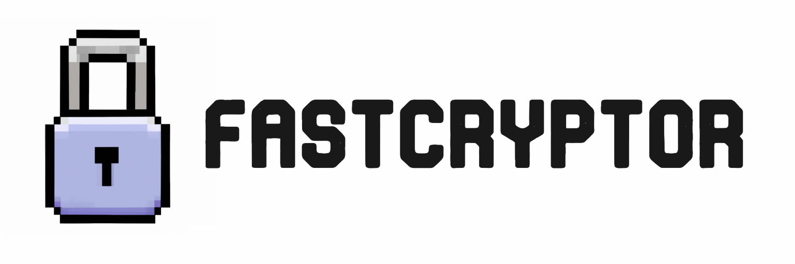

<p align="center">
    
    </p>
    <p align="center">
        <em>Fast XOR File Encryption/Decryption</em>
</p>
<p align="center">
    <a href="https://cplusplus.com/" target="_blank">
        
    </a>
    <a href="https://www.linux.org/" target="_blank">
        
    </a>
    <a href="https://www.microsoft.com/en-us/windows" target="_blank">
        
    </a>
    <a href="https://www.apple.com/macos/ventura/" target="_blank">
        
    </a>
    <a href="https://snyk.io/" target="_blank">
        
    </a>
    <a href="https://github.com/Falcn8/FastCryptor/LICENSE" target="_blank">
        
    </a>
</p>

This project contains a pair of **C++** programs for encrypting and decrypting files using the **XOR cipher**. The programs are designed to be fast and efficient, and can encrypt/decrypt entire directories, **including subdirectories**. The programs are written in C++ and are **cross-platform**. The programs are designed to be used in the terminal. I also added `compile.sh` and `compile.bat` to compile the programs.

## Features

- Encrypts files using a key.
- Decrypts files encrypted using the encryption program.
- Can encrypt/decrypt entire directories, including subdirectories.

## Usage

### Clone

Clone the repository using the following command:

For Linux:

```bash
git clone https://github.com/Falcn8/FastCryptor.git
cd FastCryptor
chmod +x compile.sh
./compile.sh
```

For Windows: just double click the `compile.bat` file

### Compile

To compile the programs, run the `compile.sh` file. This will compile the programs and place the executables in the `build/` directory.

### Encryption

To encrypt a directory, run the encryption program in the directory you want to encrypt.

### Decryption

To decrypt a directory, run the decryption program in the directory you want to decrypt.

## About v4

We introduced a `BUFFER_SIZE` constant to determine the size of the buffer used for reading and processing file data. Adjust this value based on your specific requirements.  
The file encryption process now reads and processes the input file in chunks, reducing the number of I/O operations. It uses a buffer to read and write data efficiently.  
Encryption progress is no longer displayed for each file individually but instead shows a message when a file is successfully encrypted.  


## Advertisement

Introducing FastCryptor: The Ultimate File Encryption Solution!  

Are you concerned about the security of your sensitive files? Look no further! FastCryptor is here to protect your valuable data with its advanced encryption features.  

Key Features:  

1. Whitelisting Capabilities: Easily exclude specific files from encryption by adding them to the whitelist. Keep your important files untouched and secure, ensuring uninterrupted access whenever you need them.  

2. Efficient Encryption Algorithms: FastCryptor utilizes a powerful encryption algorithm based on a secret key, making it virtually impossible for unauthorized individuals to access your encrypted files. Rest easy knowing that your data is protected against prying eyes.  

3. Lightning-Fast Encryption: With FastCryptor, you'll experience blazing-fast encryption speeds. It intelligently processes your files, encrypting them on the fly, without compromising the performance of your system. It's encryption at the speed of light!  

4. Seamless Directory Encryption: Safeguard entire directories effortlessly! FastCryptor can recursively encrypt all files within a directory, ensuring comprehensive protection for your valuable data. Easily encrypt large volumes of files with just a few clicks.  

5. User-Friendly Interface: FastCryptor features an intuitive interface that makes it easy for anyone to use, regardless of their technical expertise. Simply select the directory you want to encrypt, and FastCryptor takes care of the rest. It's encryption made simple.  

Experience the power of FastCryptor today and enjoy the peace of mind that comes with knowing your files are secure. Say goodbye to data breaches and hello to enhanced privacy and protection. Don't wait, take control of your data security now!  

## Note

- Make sure to keep the key used for encryption safe, as it is required for decryption.
- Use this program at your own risk. The author takes no responsibility for any data loss or corruption that may occur.
